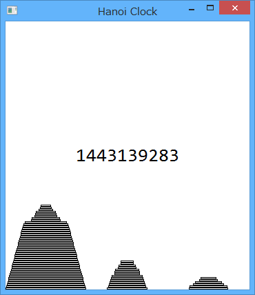

ハノイ時計
===========

あのパズルの[ハノイの塔](https://ja.wikipedia.org/wiki/%E3%83%8F%E3%83%8E%E3%82%A4%E3%81%AE%E5%A1%94)をUNIX時間（1970年1月1日午前0時0分0秒からの秒数）の回数分だけ円盤を移動させたものを表示するプログラム。
上記Wikipediaの『2進数による解析』のアルゴリズムを参考に作成しました。

## プレビュー

## ダウンロード方法

- [ここ](https://github.com/hack-jp/HanoiClock/archive/master.zip) からダウンロードして解凍してください。

## ライセンス

MIT Licence
